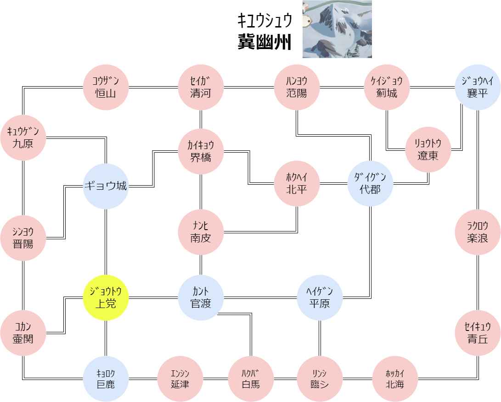
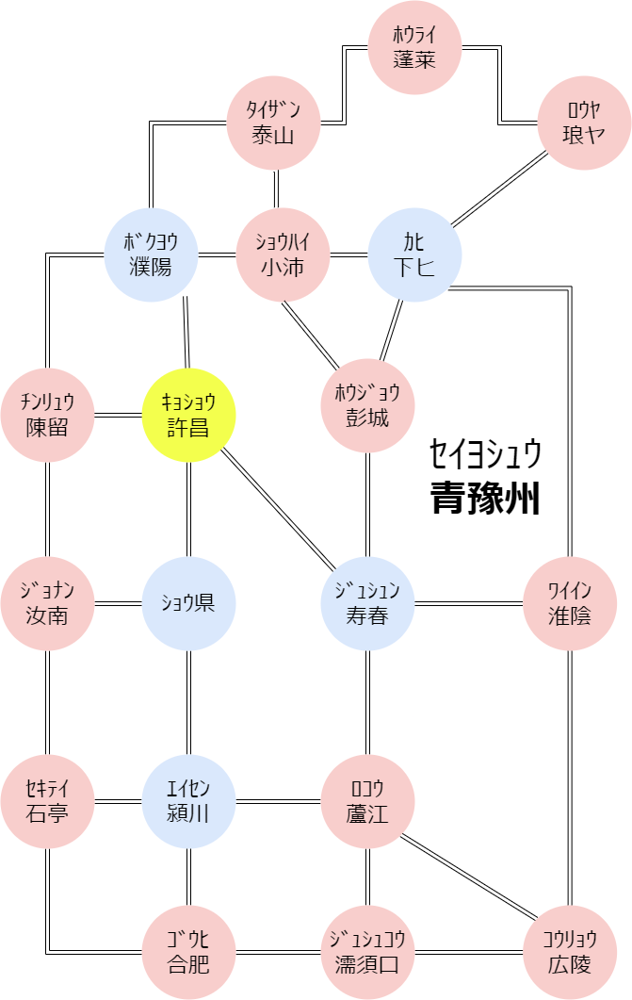
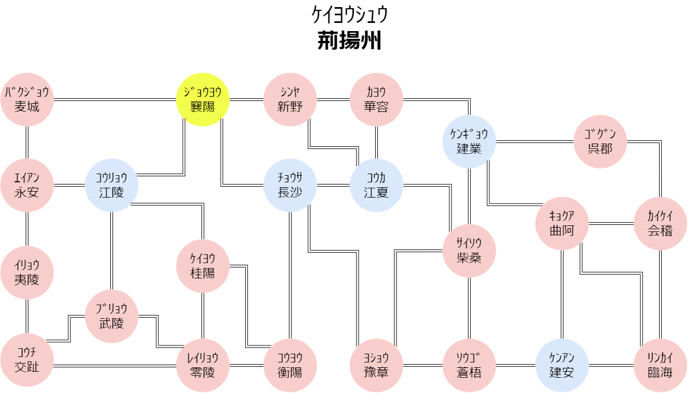
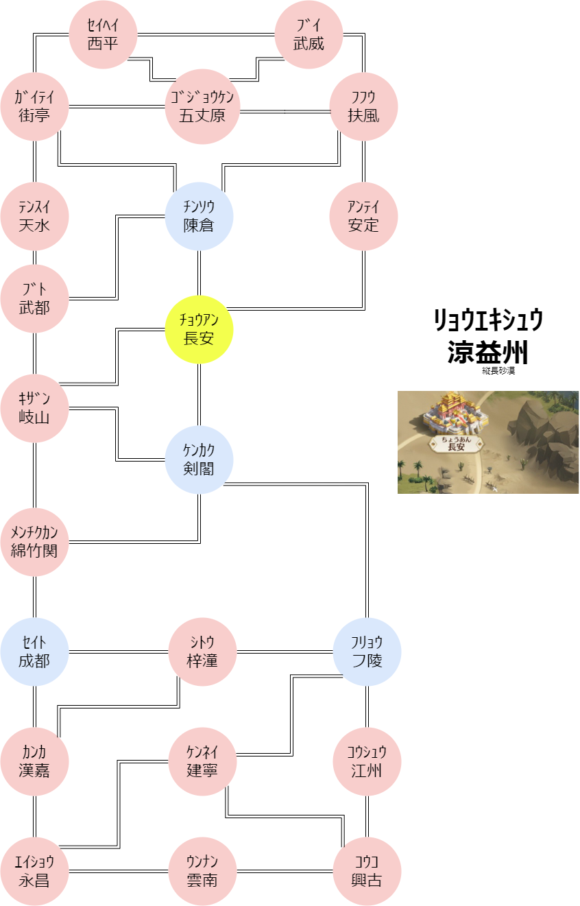
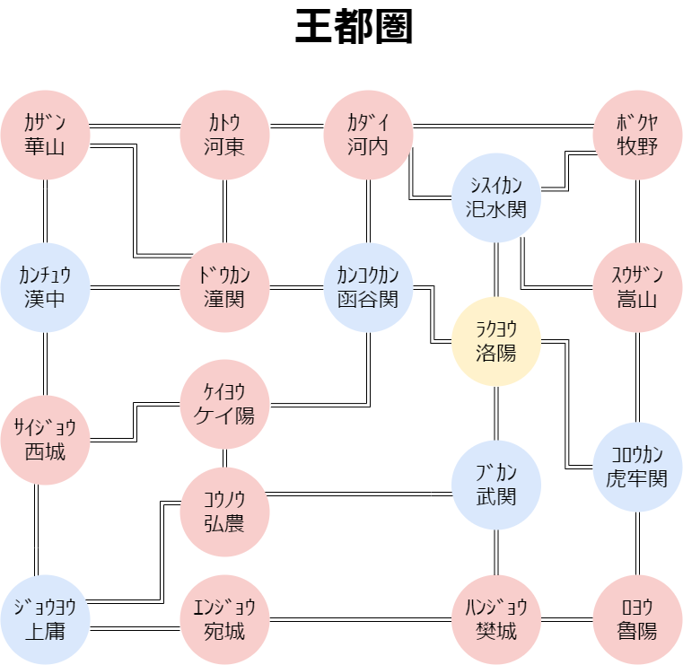
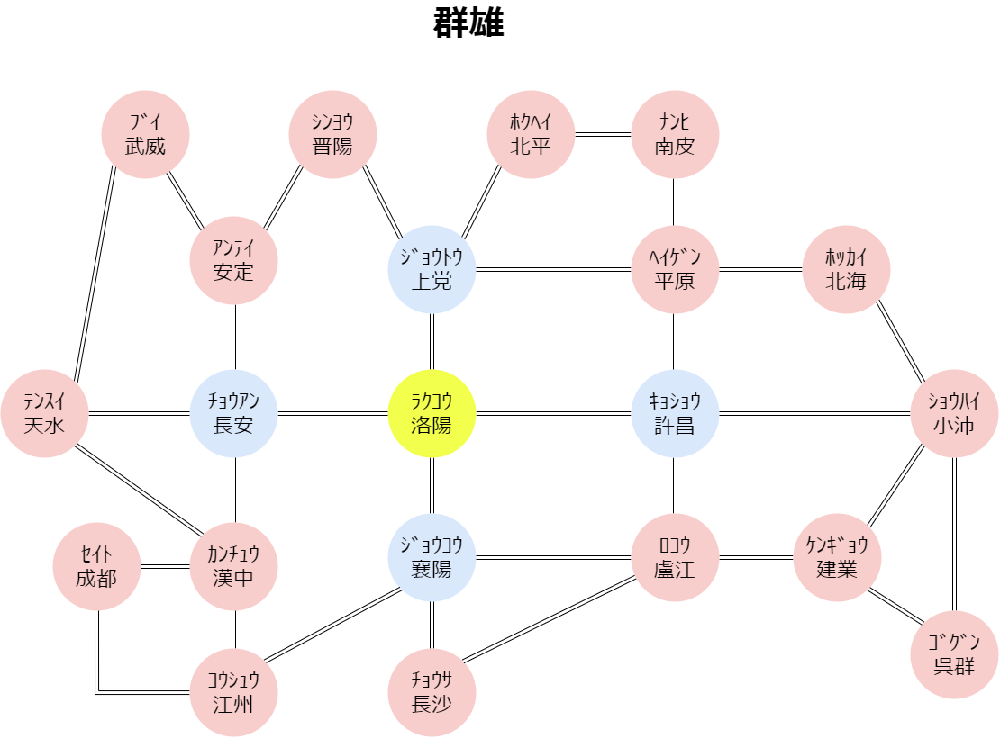

# AbondonedGirl
捨てられた女の子。つまり"放置少女"のレポジトリー。傾国のマップとかそういうの。
## 更新情報
- 9月28日
  - キユウシュウのマップデータに、誤りがあったので直しました。(セイガ-カイキョウの道を追加)
  - セイヨシュウのマップデータに、誤りがあったので直しました。(エイセン-ロコウの道を追加)
  - リョウエキシュウのマップデータに誤りがあったので直しました。
- 10月20日
  - ケイヨウシュウのマップデータを実際のゲーム画面と見比べて、正しいことを確認しました。
  - キユウシュウのマップデータを実際のゲーム画面と見比べて、正しいことを確認しました。
  - セイヨシュウのマップデータを実際のゲーム画面と見比べて、正しいことを確認しました。
  - セイヨシュウのマップデータが見目麗しゅうございませんでしたので、軽微な修正を施しました。
  - **群雄のマップも追加しました。多分あってます**
- マップ一覧
  - [キユウシュウ](#kiyu)
  - [セイヨシュウ](#seiyo)
  - [ケイヨウシュウ](#keiyou)
  - [リョウエキシュウ](#ryoueki)
  - [オウトケン](#outo)
  - [群雄](#gunyu)

1.  キユウシュウ 
2. セイヨシュウ
3. ケイヨウシュウ
4. リョウエキシュウ
5.  オウトケン

6.  群雄

